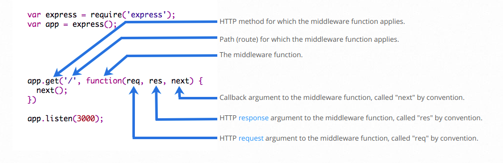

# webservices_nodeJS

I will practicing  NodeJS web services like Empress.JS, Sails.JS and Hapi.JS 

Oh yeah, I am using Ubuntu. So, please check the documentation for for other OS. hoping it will be quite same. 


## ExpressJS
	
###### STEP 1: Installation
	- Let's start with ExpressJS. 
	- Install Express : [INSTALLATION GUIDE: http://expressjs.com/en/starter/installing.html] 
		- $ mkdir expressjs
		- $ cd expressjs
		- $ npm init
		- Now install Express in the myapp directory and save it in the dependencies list.
			- $ npm install express --save

###### STEP 2: Create the working JS
	- $ touch index.js

###### STEP 3: Create First Hello World app [http://expressjs.com/en/starter/hello-world.html]
	- Copy paste the code in index.js

```
			const express = require('express')
			const app = express()
			const port = 3000

			app.get('/', (req, res) => res.send('Hello World!'))

			app.listen(port, () => console.log(`Example app listening on port ${port}!`))

``` 

###### STEP 4: Run the index.js
	- $ node index.js
		- Your first Hello World! will be running at http://localhost:3000/


###### STEP 5: Let's discuss the code [http://expressjs.com/en/guide/writing-middleware.html]



###### EXPRESS JS DOCUMENTATION
		- https://expressjs.com/en/guide/writing-middleware.html


## SailsJS


###### STEP 1: Getting Started
	- INTRODUCTION: https://sailsjs.com/
	- GETTING STARTED: https://sailsjs.com/get-started


###### STEP 2: INSTALLATION
```
	$ npm install sails -g // @dev: at Global level
```


###### STEP 3: CREATE YOUR APP
	- To generate a new app, just cd into the directory where you want it to be, and type:
	- Also select 1 for default Template

```
sails new test-project
```		 	

###### STEP 4: NAVIGATE TO APP

```
cd test-project
sails lift
```
	- Now you can go to localhost:1337 to see your brand new homepage.


## HAPIJS 

###### STEP 1: Installing Hapi [https://hapijs.com/tutorials ]

```
	mkdir hapijs
	cd hapijs
	npm init
	npm install hapi --save 
	touch server.js
```

###### STEP 2: Update Server.js


###### STEP 4: Run the Application
```
npm start
```
	
	- Now you can go to  http://localhost:8000/hello

